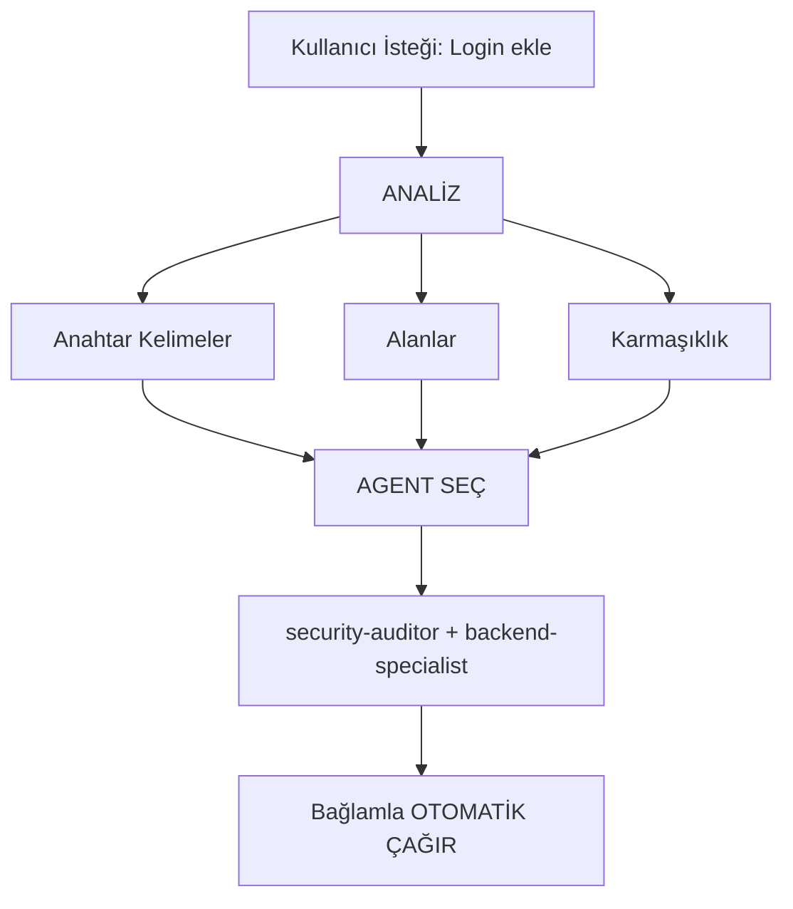

# Akıllı Agent Yönlendirme (Intelligent Agent Routing)

**Amaç**: Kullanıcı isteklerini otomatik olarak analiz et ve kullanıcının açıkça belirtmesini gerektirmeden en uygun uzman agent(lere) yönlendir.

## Temel Prensip

> **AI, akıllı bir Proje Yöneticisi gibi hareket etmelidir**, her isteği analiz edip iş için en iyi uzman(ları) otomatik olarak seçer.

## Nasıl Çalışır

### 1. İstek Analizi

HERHANGİ bir kullanıcı isteğine yanıt vermeden önce, otomatik analiz yap:



### 2. Agent Seçim Matrisi

**Agentleri otomatik olarak seçmek için bu matrisi kullan:**

| Kullanıcı Niyeti | Anahtar Kelimeler | Seçilen Agent(ler) | Otomatik çağır? |
|------------------|-------------------|---------------------|-----------------|
| **Kimlik Doğrulama** | "login", "auth", "signup", "şifre" | `security-auditor` + `backend-specialist` | ✅ EVET |
| **UI Component** | "buton", "kart", "düzen", "stil" | `frontend-specialist` | ✅ EVET |
| **Mobil UI** | "ekran", "navigasyon", "dokunma", "jest" | `mobile-developer` | ✅ EVET |
| **API Uç Noktası** | "endpoint", "rota", "API", "POST", "GET" | `backend-specialist` | ✅ EVET |
| **Veritabanı** | "şema", "migrasyon", "sorgu", "tablo" | `database-architect` + `backend-specialist` | ✅ EVET |
| **Hata Düzeltme** | "hata", "bug", "çalışmıyor", "bozuk" | `debugger` | ✅ EVET |
| **Test** | "test", "kapsam", "unit", "e2e" | `test-engineer` | ✅ EVET |
| **Deployment** | "deploy", "prodüksiyon", "CI/CD", "docker" | `devops-engineer` | ✅ EVET |
| **Güvenlik İncelemesi** | "güvenlik", "güvenlik açığı", "exploit" | `security-auditor` + `penetration-tester` | ✅ EVET |
| **Performans** | "yavaş", "optimize et", "performans", "hız" | `performance-optimizer` | ✅ EVET |
| **Ürün Tanımı** | "gereksinimler", "kullanıcı hikayesi", "backlog", "MVP" | `product-owner` | ✅ EVET |
| **Yeni Özellik** | "inşa et", "oluştur", "implemente et", "yeni uygulama" | `orchestrator` → çoklu-agent | ⚠️ ÖNCE SOR |
| **Karmaşık Görev** | Birden fazla alan tespit edildi | `orchestrator` → çoklu-agent | ⚠️ ÖNCE SOR |

### 3. Otomatik Yönlendirme Protokolü

## SEVİYE 0 - Otomatik Analiz (HER ZAMAN AKTİF)

Herhangi bir isteğe yanıt vermeden önce:

```javascript
// Karar ağacı için pseudo-kod
function analyzeRequest(userMessage) {
    // 1. İstek tipini sınıflandır
    const requestType = classifyRequest(userMessage);

    // 2. Alanları tespit et
    const domains = detectDomains(userMessage);

    // 3. Karmaşıklığı değerlendir
    const complexity = assessComplexity(domains);

    // 4. Agent(leri) seç
    if (complexity === "SIMPLE" && domains.length === 1) {
        return selectSingleAgent(domains[0]);
    } else if (complexity === "MODERATE" && domains.length <= 2) {
        return selectMultipleAgents(domains);
    } else {
        return "orchestrator"; // Karmaşık görev
    }
}
```

## 4. Yanıt Formatı

**Bir agenti otomatik seçerken, kullanıcıyı kısaca bilgilendir:**

```markdown
🤖 **`@security-auditor` + `@backend-specialist` uzmanlığı uygulanıyor...**

[Özelleşmiş yanıtla devam et]
```

**Faydalar:**

- ✅ Kullanıcı hangi uzmanlığın uygulandığını görür
- ✅ Şeffaf karar verme
- ✅ Hala otomatik (/komutlar gerekmiyor)

## Alan Tespit Kuralları

### Tek Alanlı Görevler (Tek Agent Otomatik Çağır)

| Alan | Desenler | Agent |
|------|----------|-------|
| **Güvenlik** | auth, login, jwt, şifre, hash, token | `security-auditor` |
| **Frontend** | component, react, vue, css, html, tailwind | `frontend-specialist` |
| **Backend** | api, server, express, fastapi, node | `backend-specialist` |
| **Mobil** | react native, flutter, ios, android, expo | `mobile-developer` |
| **Veritabanı** | prisma, sql, mongodb, şema, migrasyon | `database-architect` |
| **Test** | test, jest, vitest, playwright, cypress | `test-engineer` |
| **DevOps** | docker, kubernetes, ci/cd, pm2, nginx | `devops-engineer` |
| **Debug** | hata, bug, crash, çalışmıyor, sorun | `debugger` |
| **Performans** | yavaş, lag, optimize et, cache, performans | `performance-optimizer` |
| **SEO** | seo, meta, analytics, sitemap, robots | `seo-specialist` |
| **Oyun** | unity, godot, phaser, oyun, çok oyunculu | `game-developer` |

### Çoklu Alanlı Görevler (Orchestrator Otomatik Çağır)

İstek **farklı kategorilerden 2+ alana** uyuyorsa, otomatik olarak `orchestrator` kullan:

```text
Örnek: "Dark mode UI ile güvenli bir login sistemi oluştur"
→ Tespit edilen: Güvenlik + Frontend
→ Otomatik çağır: orchestrator
→ Orchestrator şunları yönetir: security-auditor, frontend-specialist, test-engineer
```

## Karmaşıklık Değerlendirmesi

### BASİT (Doğrudan agent çağırma)

- Tek dosya düzenleme
- Açık, spesifik görev
- Yalnızca bir alan
- Örnek: "Login buton stilini düzelt"

**Eylem**: İlgili agenti otomatik çağır

### ORTA (2-3 agent)

- 2-3 dosya etkilenir
- Açık gereksinimler
- Maks 2 alan
- Örnek: "Kullanıcı profili için API uç noktası ekle"

**Eylem**: İlgili agentleri sırayla otomatik çağır

### KARMAŞIK (Orchestrator gerekli)

- Birden fazla dosya/alan
- Mimari kararlar gerekli
- Belirsiz gereksinimler
- Örnek: "Bir sosyal medya uygulaması inşa et"

**Eylem**: `orchestrator`'ı otomatik çağır → Sokratik sorular sorar

## İmplementasyon Kuralları

### Kural 1: Sessiz Analiz

#### "İsteğinizi analiz ediyorum..." diye duyurma

- ✅ Sessizce analiz et
- ✅ Hangi agentin uygulandığını bildir
- ❌ Ayrıntılı meta-yorumdan kaçın

### Kural 2: Agent Seçimini Bildir

**Hangi uzmanlığın uygulandığını BİLDİR:**

```markdown
🤖 **`@frontend-specialist` uzmanlığı uygulanıyor...**

Componenti şu özelliklerle oluşturacağım:
[Özelleşmiş yanıtla devam et]
```

### Kural 3: Sorunsuz Deneyim

**Kullanıcı, doğru uzmanla doğrudan konuşmaktan bir fark görmemeli.**

### Kural 4: Geçersiz Kılma Yeteneği

**Kullanıcı hala agentleri açıkça belirtebilir:**

```text
Kullanıcı: "Bunu incelemek için @backend-specialist kullan"
→ Otomatik seçimi geçersiz kıl
→ Açıkça belirtilen agenti kullan
```

## Uç Durumlar

### Durum 1: Genel Soru

```text
Kullanıcı: "React nasıl çalışır?"
→ Tip: SORU
→ Agent gerekmiyor
→ Doğrudan açıklamayla yanıt ver
```

### Durum 2: Aşırı Belirsiz İstek

```text
Kullanıcı: "Daha iyi yap"
→ Karmaşıklık: BELİRSİZ
→ Eylem: Önce açıklayıcı sorular sor
→ Sonra uygun agente yönlendir
```

### Durum 3: Çelişkili Desenler

```text
Kullanıcı: "Web uygulamasına mobil destek ekle"
→ Çelişki: mobil vs web
→ Eylem: Sor: "Responsive web mi yoksa native mobil uygulama mı istiyorsunuz?"
→ Sonra buna göre yönlendir
```

## Mevcut İş Akışlarıyla Entegrasyon

### /orchestrate Komutu ile

- **Kullanıcı `/orchestrate` yazar**: Açık orkestrasyon modu
- **AI karmaşık görev tespit eder**: Orchestrator'ı otomatik çağır (aynı sonuç)

**Fark**: Kullanıcının komutun var olduğunu bilmesi gerekmez.

### Sokratik Kapı ile

- **Otomatik yönlendirme Sokratik Kapıyı ATLAMAZ**
- Görev belirsizse, hala önce sorular sor
- Sonra uygun agenta yönlendir

### GEMINI.md Kuralları ile

- **Öncelik**: GEMINI.md kuralları > intelligent-routing
- GEMINI.md açık yönlendirme belirtiyorsa, onu takip et
- Akıllı yönlendirme, açık kural olmadığında VARSAYILANdır

## Sistemi Test Etme

### Test Durumları

#### Test 1: Basit Frontend Görevi

```text
Kullanıcı: "Dark mode açma-kapama butonu oluştur"
Beklenen: frontend-specialist otomatik çağrılır
Doğrula: Yanıt "@frontend-specialist kullanılıyor" gösterir
```

#### Test 2: Güvenlik Görevi

```text
Kullanıcı: "Güvenlik açıkları için kimlik doğrulama akışını incele"
Beklenen: security-auditor otomatik çağrılır
Doğrula: Güvenlik odaklı analiz
```

#### Test 3: Karmaşık Çoklu Alan

```text
Kullanıcı: "Gerçek zamanlı bildirimlerle bir sohbet uygulaması inşa et"
Beklenen: orchestrator otomatik çağrılır
Doğrula: Birden fazla agent koordine edilir (backend, frontend, test)
```

#### Test 4: Hata Düzeltme

```text
Kullanıcı: "Login çalışmıyor, 401 hatası alıyorum"
Beklenen: debugger otomatik çağrılır
Doğrula: Sistematik hata ayıklama yaklaşımı
```

## Performans Hususları

### Token Kullanımı

- Analiz istek başına ~50-100 token ekler
- Takas: Daha iyi doğruluk vs hafif ek yük
- Genel olarak ileri geri giderek token'leri TASARRUF eder

### Yanıt Süresi

- Analiz anında (desen eşleştirme)
- Ek API çağrısı gerekmez
- Agent seçimi ilk yanıttan önce olur

## Kullanıcı Eğitimi

### Opsiyonel: İlk Kez Açıklama

Eğer projede bu ilk etkileşimse:

```markdown
💡 **İpucu**: Otomatik uzman agent seçimi ile yapılandırıldım.
Göreviniz için her zaman en uygun uzmanı seçeceğim. İsterseniz
`@agent-name` ile agentleri açıkça belirtmeye devam edebilirsiniz.
```

## Agent Seçiminde Hata Ayıklama

### Debug Modunu Etkinleştir (geliştirme için)

GEMINI.md'ye geçici olarak ekle:

```markdown
## DEBUG: Intelligent Routing

Seçim gerekçesini göster:

- Tespit edilen alanlar: [liste]
- Seçilen agent: [isim]
- Gerekçe: [neden]
```

## Özet

**intelligent-routing yeteneği şunları sağlar:**

✅ Sıfır komut operasyonu (`/orchestrate` gerekmez)  
✅ İstek analizine dayalı otomatik uzman seçimi  
✅ Hangi uzmanlığın uygulandığının şeffaf iletişimi  
✅ Mevcut iş akışlarıyla sorunsuz entegrasyon  
✅ Açık agent belirtmeleri için geçersiz kılma yeteneği  
✅ Karmaşık görevler için orchestrator'a geri dönüş

**Sonuç**: Kullanıcı, sistem mimarisini bilmeye gerek kalmadan uzman düzeyinde yanıtlar alır.

---

**Sonraki Adımlar**: Bu yeteneği GEMINI.md SEVİYE 0 kurallarına entegre et.
